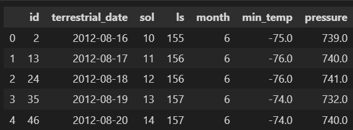
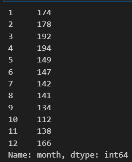
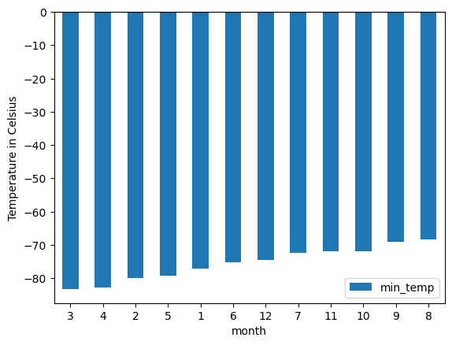
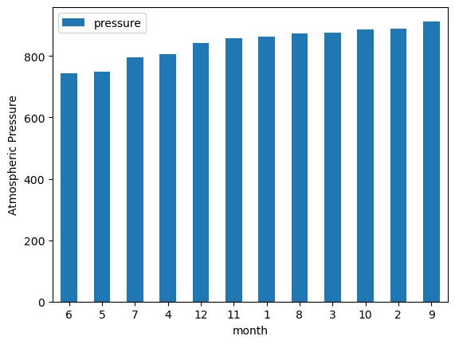
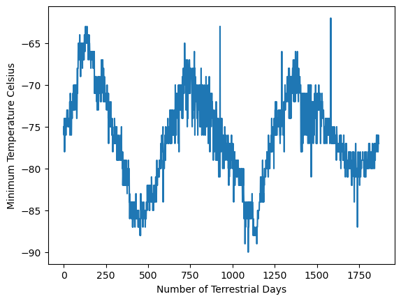

# Mission to Mars

## Project Overview

### Purpose

The purpose of this project is to utilize `splinter` and `BeautifulSoup` to scrape, clean, and sort data related to Mars. The first set of data will be **Mars news**. The second set of data will be **Mars Weather Data** - and this data will be further analyzed.

## Results

### Part 1 - Web Scraping Mars News

1. Utilizing the `splinter`, `BeautifulSoup`, and `webdriver_manager` libraries, I used `Jupyter Notebook` to scrape 1 webpage of news article titles and summaries about Mars. 

2. I stored the scraped data into a list of dictionaries. 

3. Finally, I decided to store the information locally using 2 methods: 
    - Saving the data to `article_info.json`
    - Creating a `MongoDB` database & collection and storing the data within.

### Part 2 - Web Scraping Mars Weather Data and Analyzing

#### Gathering Data

1. Utilizing the `matplotlib`, `pandas`, `splinter`, `BeautifulSoup`, and `webdriver_manager` libraries, I used `Jupyter Notebook` to scrape weather data from a webpage containing a table of the desired information. 

2. A `pandas` data frame was then created with the data.

3. The data was converted to appropriate data types.

#### Analysis
Data frame top 5 rows:



The amount of months on Mars was determined to be 12 by the following code:
```python
mars_df['month'].value_counts().sort_index()
```


The amount of Martian days worth of data was determined to be 1867 by:
```python
mars_df['sol'].drop_duplicates().count()
```
I decided to use `.drop_duplicates()` in case there were double entries under the same `sol` value.<br>
*(**Sol**: a solar day on Mars; that is, a Mars-day.)*<br><br>

---

Minimum Temperature:
```python
monthly_avg_low_temp = mars_df[['month', 'min_temp']].groupby('month').mean()
```
Average Minimum Temperature Chart:


- The 3rd month is the coldest on average
- The 8th month is the warmest on average

---

Atmospheric Pressure:
```python
monthly_avg_pressure = mars_df[['pressure', 'month']].groupby('month').mean()
```

Average Atmospheric Pressure Chart:


- The 6th month has the lowest atmospheric pressure on average
- The 9th month has the highest atmospheric pressure on average

---

Visualizing every minimum temperature data point on a chart allowed for a visual estimate to be made about the amount of terrestrial days in a Martian year. 


- The distance from peak to peak is roughly 1425-750, or **675 days**. A year on Mars appears to be about 675 days from the plot. Internet search confirms that a Mars year is equivalent to 687 earth days.

## Bonus

I decided I wasn't happy with using an internet search for the final answer to determine how many terrestrial days there are in a Martian year. So I used the following line of code on the `Mars Weather Data` to figure it out:

```python
month_list = list(range(1,13))
start_counting = False
for index, row in mars_df.iterrows():
    cur_month = row['month']
    next_month = mars_df.iloc[index+1]['month']

    # Start counting days at first full month of data and record first_day
    # You could use any month value, except for 6
    if cur_month == 7 and not start_counting:
        start_counting = True
        first_day = row['terrestrial_date']

    # Start counting
    if start_counting and (cur_month in month_list):

        # If the next month entry is a change from the current, then the month is over and we can remove it from the list
        if next_month != cur_month:
            month_list.remove(cur_month)

            # Break iteration if month_list is exhausted, and record the next day as last_day
            if month_list == []:
                last_day = mars_df.iloc[index+1]['terrestrial_date']
                break

earth_days = last_day - first_day
print(f'Number of terrestrial days in 1 Mars Year: {earth_days.days} days')
```

Output: 
```
Number of terrestrial days in 1 Mars Year: 687 days
```
